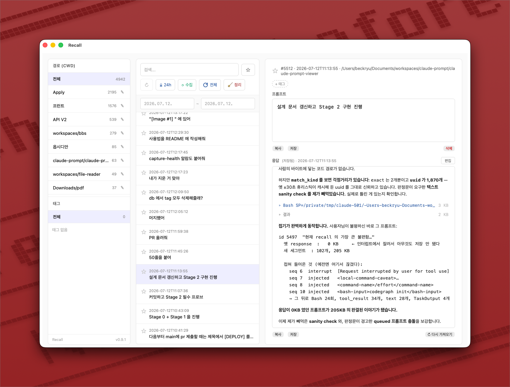

# Recall

[English](README.md) · **한국어**

**Claude Code 프롬프트 기록을 찾아보는 로컬 데스크톱 앱.**

Claude Code는 내가 무엇을 물어봤는지 검색할 수 있는 기록을 남기지 않습니다. 3주 전에 썼던 그 좋은 프롬프트 — 마침내 리팩터링을 제대로 굴러가게 만들었던 바로 그 프롬프트 — 는 다시는 찾을 수 없는 세션 트랜스크립트 어딘가에 묻혀 있습니다.

Recall은 그 문제를 해결합니다. hook이 제출하는 모든 프롬프트를 로컬 SQLite 데이터베이스에 기록하고, 앱은 그 데이터베이스를 검색·태그·북마크가 가능한 아카이브로 바꿔줍니다. 각 프롬프트에는 Claude가 실제로 준 응답이 함께 붙습니다.

모든 데이터는 내 컴퓨터 안에만 있습니다. 네트워크 통신도, 텔레메트리도, 계정도 없습니다.



<p align="center">
  <em>왼쪽에 프로젝트와 태그, 가운데에 프롬프트 기록, 오른쪽에 프롬프트와 Claude의 응답.<br>
  화면에 열려 있는 프롬프트는 뒤쪽 목록에 보이는 "응답 없음" 뱃지를 만들어낸 바로 그 프롬프트입니다 — Recall이 Recall의 제작 과정을 되짚고 있는 셈이죠.</em>
</p>

---

## 무엇을 할 수 있나

- **검색** — 지금까지 제출한 모든 프롬프트를 대상으로 찾습니다.
- **프로젝트별 그룹핑** — 작업 디렉터리(cwd) 기준으로 묶이며, 각각에 읽기 좋은 별칭을 붙일 수 있습니다 (`/Users/you/dev/some-long-path` → `Payments API`).
- **북마크** — 두고두고 쓸 프롬프트를 표시해 둡니다.
- **태그** — 자유롭게 태그를 달고 태그로 필터링합니다.
- **날짜 범위 필터.**
- **응답 보기** — 해당 프롬프트의 세션 트랜스크립트를 찾아 Claude의 답변을 추출하고, Markdown으로 렌더링해 보여줍니다.
- **편집과 복사** — 재사용할 수 있게 프롬프트를 다듬은 뒤 클립보드로 복사합니다.
- **정리** — 응답이 없는 프롬프트를 한꺼번에 치웁니다. 먼저 트랜스크립트에서 응답을 되살려 보고, 끝내 되살릴 수 없는 것(ESC로 취소한 턴, 트랜스크립트가 사라진 세션)만 삭제 후보로 보여줍니다. 삭제 전에 DB를 자동으로 백업합니다.

---

## 동작 원리

Recall은 Claude Code가 이미 디스크에 남기고 있는 두 개의 데이터 소스를 읽어서 이어 붙입니다.

```
                 ┌─────────────────────────────┐
    프롬프트 ──▶   │  UserPromptSubmit hook      │
      제출        │  hooks/log_prompt.py        │
                 └──────────────┬──────────────┘
                                │ INSERT
                                ▼
                 ~/.claude/prompts.db      ← 프롬프트 원문, session_id, cwd, 시각
                                │
                                │  프롬프트 원문으로 join
                                ▼
                 ~/.claude/projects/<cwd>/<session_id>.jsonl
                                           ← Claude Code가 남기는 세션 트랜스크립트.
                                             어시스턴트의 응답이 여기에 있다.
                                │
                                ▼
                         ┌─────────────┐
                         │   Recall    │
                         └─────────────┘
```

hook은 프롬프트를 작성하는 순간 그것을 붙잡아 DB에 넣습니다. 하지만 **응답은 데이터베이스에 없습니다** — 응답은 Claude Code의 세션 트랜스크립트에 있습니다. 그래서 프롬프트를 열면 Recall이 해당 `.jsonl` 파일을 찾아, 그 프롬프트를 만들어낸 `user` 이벤트를 짚고, 뒤따르는 `assistant` 블록들을 모은 다음, 결과를 데이터베이스에 캐시합니다.

까다로운 부분은 **어떤 `user` 이벤트가 그 프롬프트인지 찾는 일**입니다. 프롬프트 원문으로 대조하는 방식은 통하지 않습니다. 트랜스크립트의 `message.content`는 평문 문자열일 때도, 블록 배열일 때도(이미지가 첨부된 프롬프트가 전부 여기 해당), 커맨드 래퍼일 때도 있기 때문입니다. 그래서 Recall은 원문 대신 트랜스크립트 이벤트의 **`uuid`** 로 매칭합니다. 시각(±30초 창, 동률이면 텍스트 접두로 보정)으로 uuid를 한 번 해석한 뒤 `prompts.msg_uuid`에 캐시해 두므로, 이후 조회는 정확히 일치합니다. 수집은 다음 실제 프롬프트 직전에서 멈추기 때문에, 중간에 끊긴 턴이 다음 답변까지 삼키는 일도 없습니다.

**스택:** Tauri 2 (Rust 백엔드) + React 19 + TypeScript. Rust를 쓴 이유는 속도 때문이 아니라, 브라우저 샌드박스로는 `~/.claude`를 읽을 수 없기 때문입니다.

---

## 설치

Recall은 사용자 자신의 기록을 보여주는 도구이므로, 기록이 쌓여야 비로소 쓸모가 있습니다. **hook을 먼저 설치**하고, Claude Code를 평소처럼 한동안 사용한 뒤, 앱을 실행하세요.

### 1. 프롬프트 기록 hook 설치

hook 스크립트를 Claude Code 설정 디렉터리로 복사합니다.

```bash
mkdir -p ~/.claude/hooks
cp hooks/log_prompt.py ~/.claude/hooks/log_prompt.py
```

`~/.claude/settings.json`에 `UserPromptSubmit` hook으로 등록합니다.

```json
{
  "hooks": {
    "UserPromptSubmit": [
      {
        "hooks": [
          {
            "type": "command",
            "command": "python3 $HOME/.claude/hooks/log_prompt.py"
          }
        ]
      }
    ]
  }
}
```

hook은 처음 실행될 때 `~/.claude/prompts.db`를 만들고, 이후 프롬프트마다 한 행씩 추가합니다. 어떤 오류가 나도 조용히 종료하므로, hook이 깨지더라도 프롬프트 전송 자체를 막는 일은 없습니다.

동작을 확인하려면 Claude Code에서 프롬프트를 하나 제출한 뒤 다음을 실행해 보세요.

```bash
sqlite3 ~/.claude/prompts.db "SELECT count(*) FROM prompts;"
```

### 2. 앱 빌드 및 실행

[Rust](https://rustup.rs/)와 Node.js가 필요합니다.

```bash
npm install
npm run tauri dev      # 개발 모드
npm run tauri build    # 프로덕션 번들
```

> **이전 버전 hook을 쓰고 있었다면?** Recall은 가져온 응답을 `response` 컬럼에 저장하는데, 구버전 `log_prompt.py`는 이 컬럼을 만들지 않았습니다. 앱 실행 시 오류가 난다면 컬럼을 추가하세요.
>
> ```bash
> sqlite3 ~/.claude/prompts.db "ALTER TABLE prompts ADD COLUMN response TEXT;"
> ```

---

## 데이터 취급

Recall은 완전히 오프라인으로 동작합니다. 접근하는 위치는 이미 사용자 컴퓨터에 존재하는 다음 두 곳뿐입니다.

| 경로 | 접근 |
|---|---|
| `~/.claude/prompts.db` | 읽기 **및 쓰기** |
| `~/.claude/projects/**/*.jsonl` | 읽기 전용 |
| `~/.claude/recall-backups/` | 일괄 삭제 직전에 기록 |

`prompts` 테이블은 hook이 만듭니다. 앱은 첫 실행 시 자신이 관리하는 메타데이터(북마크, 태그, 디렉터리 별칭, 응답 캐시)를 위한 테이블 다섯 개와, 해석된 트랜스크립트 이벤트를 캐시하는 `msg_uuid` 컬럼을 추가로 만듭니다.

```sql
prompts(id, session_id, cwd, prompt, created_at, response, msg_uuid)  -- 행은 hook이 기록
cwd_aliases(cwd, alias, updated_at)
prompt_bookmarks(prompt_id, created_at)
tags(id, name, created_at)
prompt_tags(prompt_id, tag_id)
prompt_responses(prompt_id, response, fetched_at)                     -- 레거시 캐시
```

**Recall은 프롬프트 기록을 수정하고 삭제할 수 있습니다.** 프롬프트를 편집하면 `prompts` 행에 `UPDATE`가 실행되고, 삭제는 실제 `DELETE`입니다. 되돌리기도, 휴지통도 없습니다.

일괄 정리는 유일한 파괴적 동작인 만큼 스스로를 지키도록 만들었습니다.

- **북마크나 태그가 달린 프롬프트는 절대 삭제 후보가 되지 않습니다.** 사용자가 손댄 흔적이 있으니 건드리지 않습니다.
- 모든 대상은 **먼저 트랜스크립트와 다시 대조합니다.** 응답을 되살릴 수 있는 것은 되살린 뒤 목록에서 빠집니다.
- **한 행이라도 지우기 전에 DB 전체를 `~/.claude/recall-backups/` 로 스냅샷합니다.** (`VACUUM INTO` 를 쓰므로 트랜잭션 일관성이 보장된 사본입니다.) 백업이 실패하면 아무것도 지우지 않습니다. 최근 10개까지 보관합니다.

정리를 되돌리려면 스냅샷 파일을 `~/.claude/prompts.db` 위에 덮어쓰면 됩니다.

---

## 알려진 한계

- **응답이 없는 프롬프트는 대개 버그가 아니라 정상입니다.** Claude가 답하기 전에 ESC로 턴을 취소했다면 보여줄 응답이 애초에 없습니다. 이제 이것을 매칭 실패와 혼동하지 않습니다.
- **응답 조회는 여전히 실패할 수 있습니다.** 트랜스크립트 이벤트를 시각과 텍스트 접두로 해석하므로, `.jsonl` 이 삭제되었거나 잘려 있으면 응답을 찾지 못합니다. 이 경우에도 프롬프트 자체는 그대로 보입니다.
- **응답은 요약된 형태이지 재생이 아닙니다.** 텍스트 블록은 원문 그대로 보존되지만, 도구 호출은 `[tool: Read]` 같은 마커로 축약됩니다. Recall이 보여주는 것은 Claude가 *말한 것*이지, Claude가 *한 모든 일*은 아닙니다.
- **빌트인 커맨드는 DB에 들어오지 않지만, 직접 만든 스킬은 들어옵니다.** `/clear`, `/compact` 같은 빌트인은 Claude Code 클라이언트가 자체적으로 처리할 뿐 프롬프트로 제출되지 않아 hook 이 아예 실행되지 않고, 따라서 행도 기록되지 않습니다. 반면 사용자가 정의한 스킬·슬래시 커맨드(`/my-skill`)는 실제 프롬프트이므로 Recall 이 다른 프롬프트와 똑같이 기록합니다.
- **hook 설치 이후의 프롬프트만 나타납니다.** 기존 트랜스크립트를 소급해서 채우는 기능은 없습니다.
- **세션은 첫 작업 디렉터리를 기준으로 묶입니다.** 세션 도중에 `cd`를 하더라도, 그 세션의 모든 프롬프트는 시작한 위치에 묶인 채로 남습니다.
- macOS에서만 사용해 본 앱입니다. Tauri 특성상 Linux와 Windows에서도 빌드될 것으로 보이지만, 어느 쪽도 테스트하지 않았습니다.

---

## 라이선스

MIT
